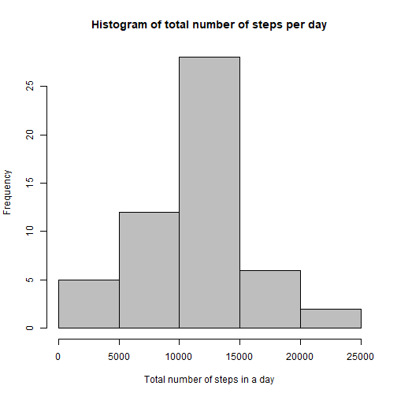
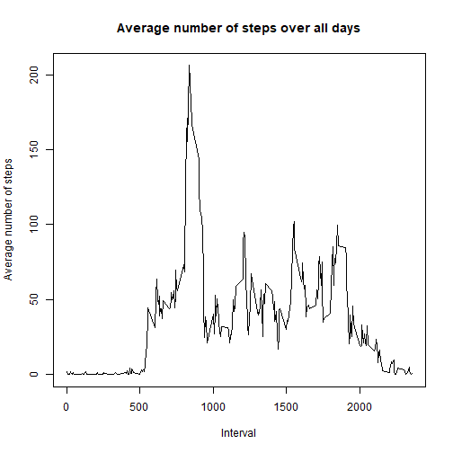
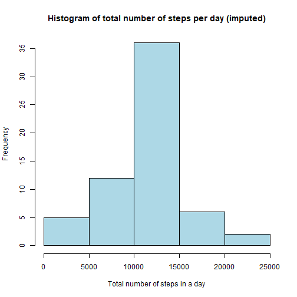
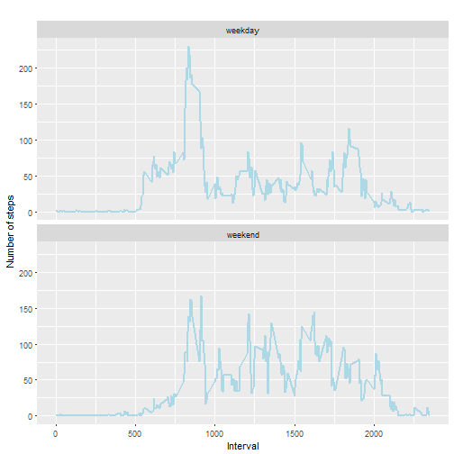

```r
### Load the Libraries
library(knitr)   
library(dplyr)  
library(ggplot2)  
```

# 1. Loading and preprocessing the data #

### Code for reading in the dataset and/or processing the data


```r
activityData <- read.csv("activity.csv",header = T,stringsAsFactors=FALSE)

activityData$date <- as.Date(activityData$date,format='%Y-%m-%d') 

#### We are loading the data and casting the date column in Date format
```


#2. Histogram of the total number of steps taken each day


```r
#### Ignore the NA values

activityData_NArm <- subset(activityData,is.na(steps)==F)

steps_by_day <- group_by(activityData_NArm, date)

steps_by_day <- summarise(steps_by_day, total = sum(steps))
```

#### **Histogram** ####



# 3. What is mean total number of steps taken per day? #


```r
#### Summarize on the data to get Mean & Meidan values

summary(steps_by_day)
```

```
##       date                total      
##  Min.   :2012-10-02   Min.   :   41  
##  1st Qu.:2012-10-16   1st Qu.: 8841  
##  Median :2012-10-29   Median :10765  
##  Mean   :2012-10-30   Mean   :10766  
##  3rd Qu.:2012-11-16   3rd Qu.:13294  
##  Max.   :2012-11-29   Max.   :21194
```


```r
Mean = 10766   
Median =  10765   
```

# 4 . Time series plot of the average number of steps taken



# 5 . The 5-minute interval that, on average, contains the maximum number of steps


```r
max_steps_row <- which.max(steps_by_interval$steps)

steps_by_interval[max_steps_row, ]
```

```
##     interval    steps
## 104      835 206.1698
```

# 6. Code to describe and show a strategy for imputing missing data


```r
#### The count of NA values in original dataset

sum(is.na(activityData))
```

```
## [1] 2304
```


```r
#### We replace the NA values with the mean value of steps for that specific interval obtained in the table **steps_by_interval**

D <- activityData

for (i in 1:nrow(D)) {
  if (is.na(D$steps[i])) {
    interval_value <- D$interval[i]
    steps_value <- steps_by_interval[
      steps_by_interval$interval == interval_value,]
    D$steps[i] <- steps_value$steps
  }
}


#### View the top 5 rows

head(D,5)
```

```
##       steps       date interval
## 1 1.7169811 2012-10-01        0
## 2 0.3396226 2012-10-01        5
## 3 0.1320755 2012-10-01       10
## 4 0.1509434 2012-10-01       15
## 5 0.0754717 2012-10-01       20
```

# 7. Histogram of the total number of steps taken each day after missing values are imputed



#### Let's compare how the results of Mean & Median are before & after replacing NA values.

```r
#### get mean and median of data without NA's
mean(imputed_steps_by_day$steps)  
```

```
## [1] 10766.19
```

```r
median(imputed_steps_by_day$steps)  
```

```
## [1] 10766.19
```

```r
#### get mean and median of data with NA's
mean(steps_by_day$total)  
```

```
## [1] 10766.19
```

```r
median(steps_by_day$total)  
```

```
## [1] 10765
```

**Mean values stays the same but therer is slight difference in meadian value**

# 8 . Panel plot comparing the average number of steps taken per 5-minute interval across weekdays and weekends




```r
#### Generate .RD file using 
#### knit("PA1_template.Rmd", output = NULL)
```
